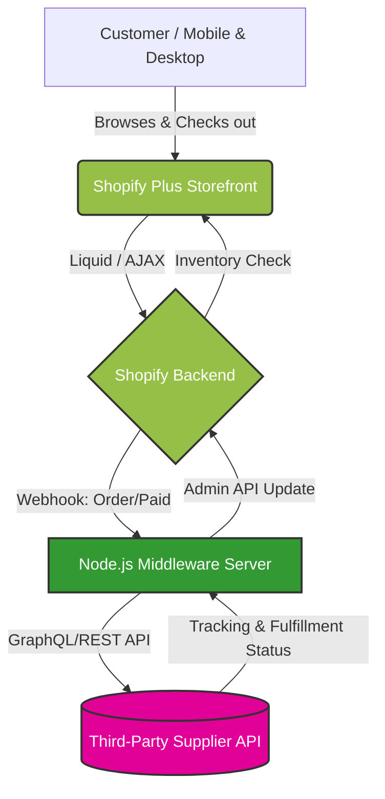

# 🛒 Enterprise E-Commerce Architecture (Shopify Plus)

[](#)
[](#)
[](#)
[](#)

> **Confidentiality Notice:** This repository contains the system architecture and integration documentation for a proprietary enterprise e-commerce build. Due to strict NDA and client security protocols, the source code, Liquid themes, and proprietary API logic have been omitted.

## 📋 Project Overview

This project involved engineering a high-traffic e-commerce platform on **Shopify Plus**. The core challenge was automating the entire dropshipping fulfillment pipeline while maintaining zero-latency synchronization between the Shopify backend and third-party supplier APIs. 

The architecture handles complex cart routing, automated inventory management, and secure webhook-driven order processing.

---

## 🏗️ System Architecture

The following diagram illustrates the decoupled architecture used to synchronize Shopify with the supplier's external systems without bottlenecking the frontend checkout experience.



## ⚙️ Architecture Highlights:
Asynchronous Webhooks: Order creation triggers an asynchronous webhook to a Node.js middleware layer, ensuring the customer's checkout speed is completely unaffected by supplier API latency.

Resilient Middleware: The custom Node.js layer handles rate-limiting, error retries, and data parsing before passing payloads to the supplier.

Automated Fulfillment: Tracking numbers and shipment statuses are automatically pushed back from the supplier to the Shopify Admin API, triggering customer notifications with zero manual intervention.

## 🔄 Transaction & Payment Routing Flow
To optimize for different geographical regions and risk profiles, custom logic was implemented to route payments dynamically.
```
sequenceDiagram
    autonumber
    participant Customer
    participant Shopify FrontEnd
    participant Shopify Backend
    participant Payment Gateway
    
    Customer->>Shopify FrontEnd: Clicks "Complete Purchase"
    Shopify FrontEnd->>Shopify Backend: Submits Cart & Customer Data
    Note over Shopify Backend: Evaluates Risk & Geolocation
    Shopify Backend->>Payment Gateway: Routes to optimal gateway (Stripe/Shopify Payments)
    Payment Gateway-->>Shopify Backend: Confirms Auth & Capture
    Shopify Backend-->>Shopify FrontEnd: Generates Order ID
    Shopify FrontEnd-->>Customer: Displays Success/Thank You Page
    Note right of Shopify Backend: Triggers fulfillment webhooks
```
## ✨ Core Technical Implementations
DOM Optimization & Liquid Templating: Restructured non-critical JavaScript to load asynchronously, strictly adhering to Core Web Vitals to maintain a sub-2-second Time to Interactive (TTI).

Idempotent API Design: Engineered the middleware integration to handle duplicate webhooks gracefully, preventing double-ordering from the supplier.

Custom Cart Logic: Utilized Shopify AJAX API to implement dynamic cart upselling and localized shipping rate calculations before checkout initiation.

## 🛠️ Technology Stack
Core Platform: Shopify Plus (Liquid, Storefront API)

Middleware Logic: Node.js, Express

Integration Layer: REST APIs, GraphQL, Shopify Admin API

Frontend Performance: SCSS, Vanilla JS (ES6+), optimized DOM manipulation
